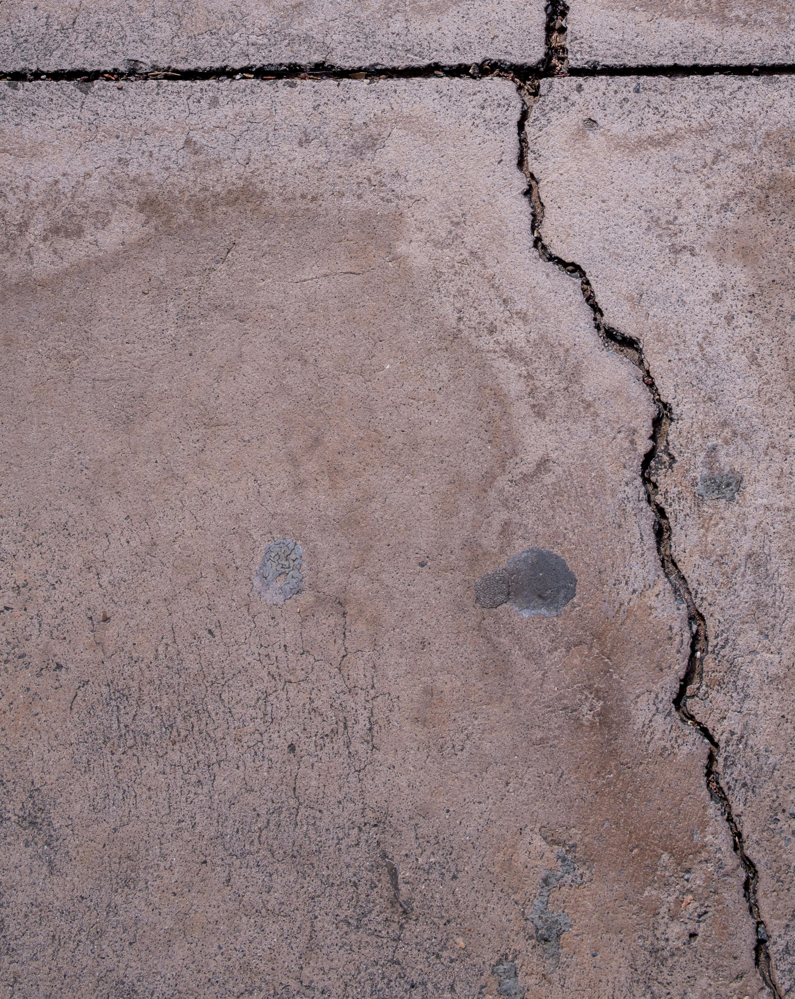
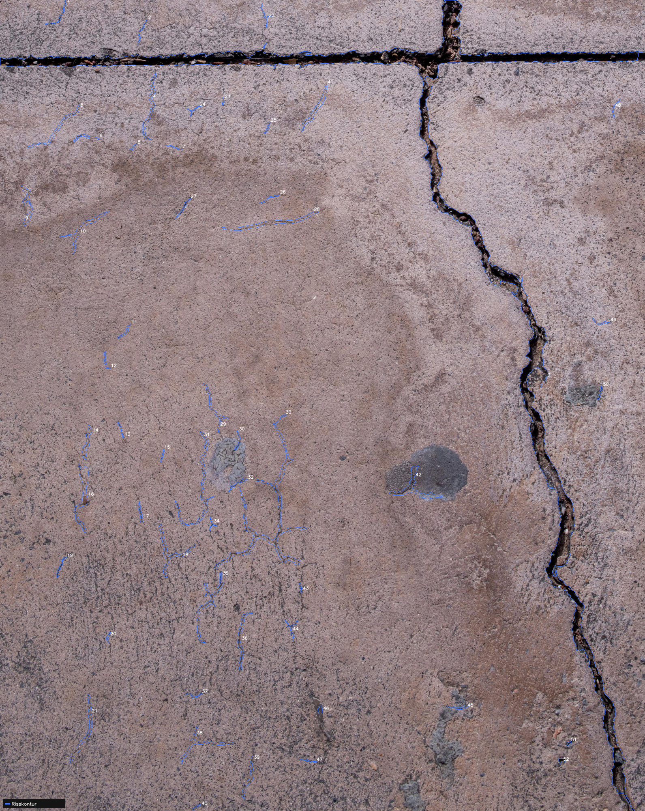
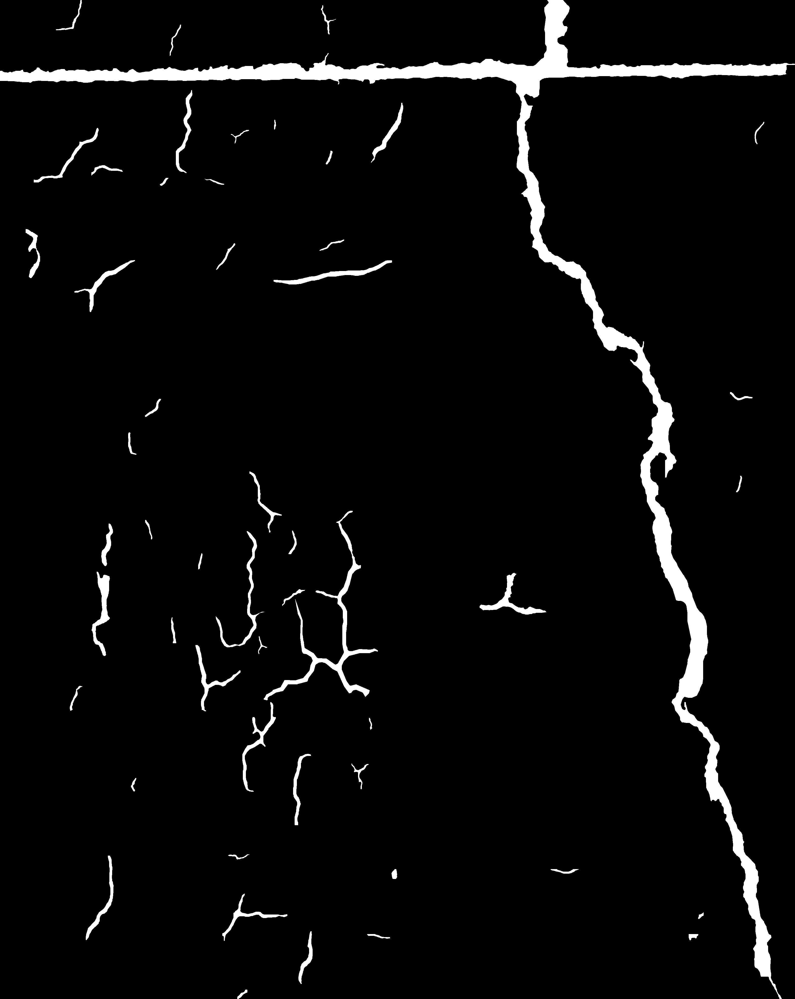

# CrackDetect

CrackDetect ist eine lokale Desktop-App zur **automatischen Riss-Erkennung** in Bauwerks-Fotos und georeferenzierten Orthofotos. Sie laeuft komplett **offline auf dem eigenen PC** (keine Cloud, keine API-Kosten) und nutzt ein speziell trainiertes U-Net Modell fuer praezise Riss-Segmentierung.

## Features

- **Vollautomatische Erkennung**: Nutzt ein trainiertes U-Net Modell (ResNet34-Backbone) fuer direkte Pixel-genaue Riss-Segmentierung.
- **Formate**: Unterstuetzt JPG, PNG, TIFF, BMP, WebP.
- **Georeferenzierung**:
  - GeoTIFF-Orthofotos mit echten Koordinaten (CRS, Affin-Transform).
  - World-File-Unterstuetzung: JPG/PNG mit Sidecar-Dateien (`.jgw` / `.pgw` / `.tfw` + `.prj`).
- **Riss-Konturen**: Die erkannten Risse werden als geschlossene Umrandungen (Konturen) exportiert - die exakte Kante jedes Risses.
- **Two-Pass Tiling fuer grosse Bilder**: Bilder werden automatisch in 512x512 px Kacheln aufgeteilt (= Modell-Trainingsgroesse, kein Qualitaetsverlust). Overlap ist adaptiv (Minimum 30%, automatisch erhoht damit Tiles das Bild gleichmaessig aufteilen). Nach Pass 1 werden zusaetzlich zentrierte Refine-Tiles direkt ueber erkannte Risse gelegt (Pass 2), damit Risse am Kachelrand vollstaendig erfasst werden. Ueberlappende Erkennungen werden zusammengefuehrt.
- **Batch-Verarbeitung**: Komplette Ordner auf einmal verarbeiten.
- **CAD & GIS Export** - wird automatisch neben dem Eingabebild gespeichert:
  - **Annotiertes Bild** (`<name>_cracks.png`): Original mit blauen Risslinien (skaliert auf max. 2000 px).
  - **GeoJSON**: Riss-Konturen als LineStrings mit echten Weltkoordinaten (CRS) und Breite in px.
  - **DXF**: Export fuer CAD (Layer `CRACKS` mit LWPOLYLINE, Layer `CRACK_LABELS`).
- **Desktop-App**: Natives Windows-Fenster (customtkinter), kein Browser noetig.

## Beispiel-Ergebnisse

Originalbild:

Erkannte Risslinien (blau eingezeichnet):

Binaere Rissmaske (Segmentierungsausgabe des Modells):

> Die gezeigten Ergebnisse wurden mit folgenden Einstellungen erzeugt, mit denen das Modell **alle feinen Risse** sicher erkannt hat:
> - **Kontur-Glaettung**: 0.0010 (sehr niedrig = maximale Detail-Treue)
> - **Kachelgroesse**: 512 px (entspricht der Modell-Trainingsgroesse, bestes Ergebnis)
> - **Feine Risse (Multi-Scale)**: aktiviert
>
> Das verwendete Bild ist **nicht Teil der Trainingsdaten** und dient ausschliesslich zur Demonstration der Erkennungsleistung.

## Installation & Start

CrackDetect ist fuer Windows konzipiert und bietet ein automatisches Setup-Skript.

1. Stelle sicher, dass **Python 3.10-3.12** und **Git** installiert sind.
2. Fuehre die Datei `start.bat` aus.
   - *Beim ersten Start:* Die virtuelle Umgebung wird erstellt, PyTorch mit CUDA sowie alle Pakete heruntergeladen (~3 GB fuer PyTorch + Abhaengigkeiten). Dieser Vorgang kann 15-40 Minuten dauern.
   - *Bei weiteren Starts:* Das Desktop-Fenster oeffnet sich direkt.

## Technologie-Stack

- **Erkennung + Segmentierung**: U-Net mit ResNet34-Backbone (PyTorch/ONNX) - trainiert auf einem proprietaeren Riss-Datensatz mit **124.796 Bildern** - direkte Pixel-Masken.
- **Kontur-Extraktion**: Polygon-Umrandung der erkannten Riss-Regionen.
- **Geo-Verarbeitung**: `rasterio` & `shapely`.
- **Export**: `ezdxf` & `json`.
- **UI**: `customtkinter` (natives Desktop-Fenster).

## Nutzung

1. Klicke auf **"Bild(er) auswaehlen"** oder **"Ordner auswaehlen"**.
2. Passe **Confidence** und **Min.-Flaeche** an.
3. Klicke auf **"Risse erkennen"**.
4. Die Ergebnisse werden automatisch im Unterordner `output/` neben dem Eingabebild gespeichert:
   - `<name>_cracks.png` - Bild mit blauen Risslinien
   - `cracks_<ts>.geojson` - Vektordaten (LineStrings)
   - `cracks_<ts>.dxf` - CAD-Export
5. Mit **"Output"** oeffnet sich der Ausgabeordner direkt im Explorer.

## Mitgeliefertes Basismodell

Das Repository enthaelt ein **vortrainiertes U-Net Modell** in zwei Formaten:

| Datei | Zweck |
|---|---|
| `model/crack_unet.onnx` | Direkt in CrackDetect verwendbar (Inferenz) |
| `model/best_model.pth` | PyTorch-Checkpoint fuer Fine-Tuning |

- Trainiert auf **124.796 annotierten Rissbildern** aus einem proprietaeren Datensatz.
- Der Datensatz gehoert ausschliesslich dem Entwickler und wird **nicht veroeffentlicht oder weitergegeben**.
- Das Modell funktioniert sehr gut und ist sofort einsatzbereit.

Wie bei jedem KI-Modell gilt: Es erkennt am zuverlaessigsten, wofuer es trainiert wurde. Fuer andere Materialien, Kameraperspektiven oder Lichtsituationen sind eigene Bilder immer die beste Grundlage, um das Modell weiter zu verbessern.

## Fine-Tuning mit eigenen Bildern

Das Modell kann mit eigenen Aufnahmen weiter trainiert werden. So lernt es genau das zu erkennen, was im jeweiligen Anwendungsfall wichtig ist - ob feine Haarrisse, breite Schadstellen oder bestimmte Materialien.

### Schritt 1 - Maske automatisch erzeugen

Das eigene Bild mit CrackDetect analysieren. Die App erzeugt dabei automatisch zwei Dateien im `output/`-Ordner:
- `<name>_cracks.png` - das Originalbild mit eingezeichneten Risslinien
- `<name>_mask.png` - die binaere Rissmaske (weiss = Riss, schwarz = Hintergrund)

### Schritt 2 - Maske manuell nachbessern (GIMP oder Photoshop)

Die erzeugte Maske in GIMP oder Photoshop oeffnen und so lange anpassen, bis sie exakt das zeigt, was das Modell kuenftig erkennen soll:
- Risse die das Modell uebersehen hat: **weiss einmalen**
- Stellen die faelschlicherweise als Riss erkannt wurden: **schwarz uebermalen**
- Feine Risse die verbreitert werden sollen: Pinsel-Haerte und -Groesse anpassen

> Die Maske muss immer rein binaer bleiben - nur reines Weiss (`#FFFFFF`) und reines Schwarz (`#000000`). Graustufen oder Antialiasing verfaelschen das Training. In GIMP: `Bild > Modus > Graustufen`, dann mit dem Pinsel-Werkzeug (Haerte 100%) arbeiten. In Photoshop: Ebene als Bitmap anlegen oder den Pinsel auf harte Kante stellen.

Je mehr sorgfaeltig nachgebesserte Masken vorhanden sind, desto gezielter lernt das Modell. Schon 20-30 gut annotierte Bilder koennen die Erkennungsleistung fuer einen bestimmten Anwendungsfall deutlich verbessern.

Dieser Zyklus (erkennen -> Maske pruefen -> nachbessern -> trainieren) laesst sich beliebig oft wiederholen, bis das Modell alles sicher erkennt, was es erkennen soll.

### Schritt 3 - Fine-Tuning

Die Trainings-Pipeline ist nicht Bestandteil dieses Repositories. Es gibt zwei Wege:

- **Eigene Pipeline aufbauen**: Das Modell basiert auf U-Net mit ResNet34-Backbone (PyTorch). Die noetige Trainingslogik laesst sich mit gaengigen Frameworks (PyTorch, segmentation-models-pytorch) selbst implementieren. Als Startgewichte dient `model/best_model.pth`.
- **Training beauftragen**: Wer die fertige Trainings-Pipeline verwenden moechte oder das Modell gezielt auf eigene Daten anpassen lassen will, kann eine Anfrage stellen - einfach Kontakt aufnehmen und die Bilder sowie die gewuenschten Erkennungsziele beschreiben.
